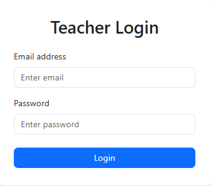
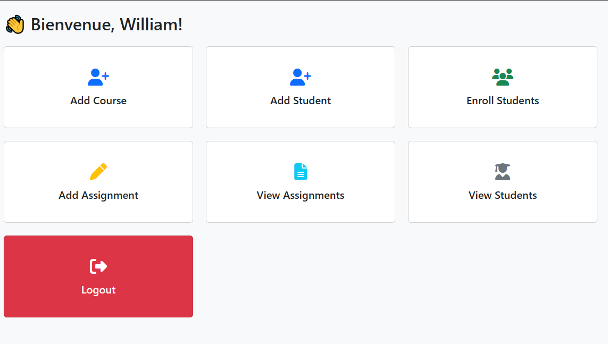
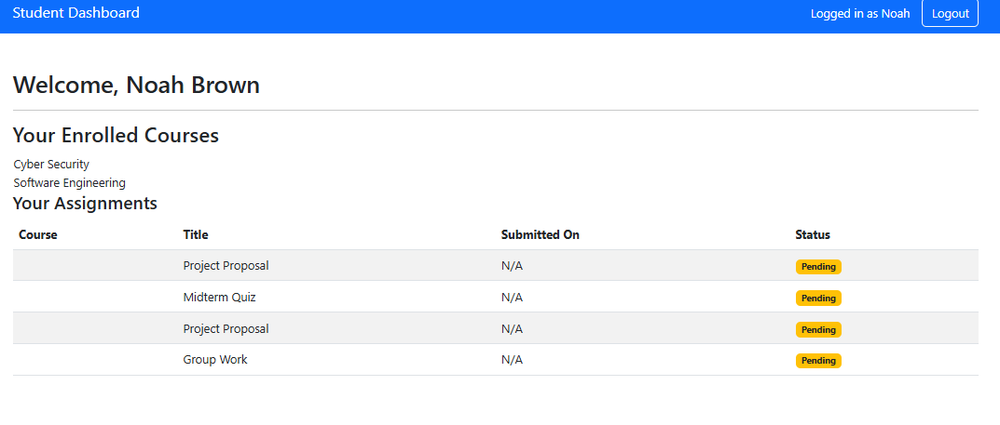
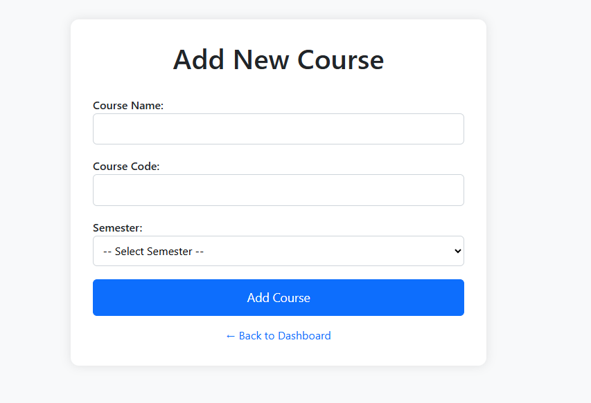
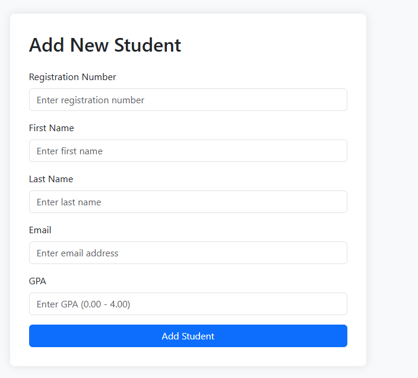
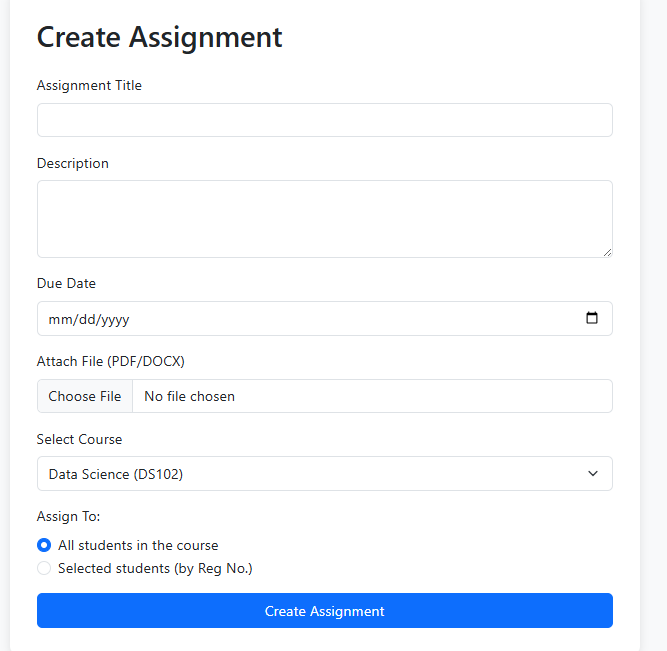
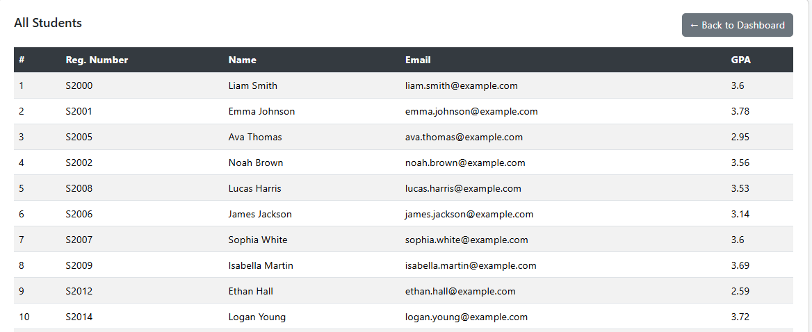
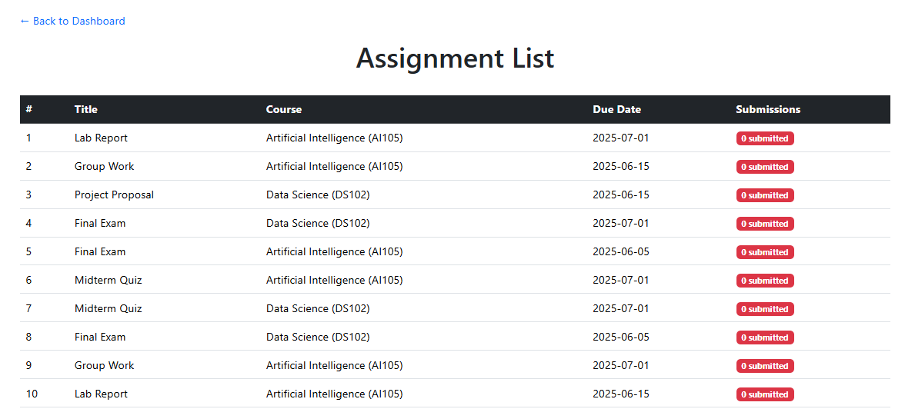
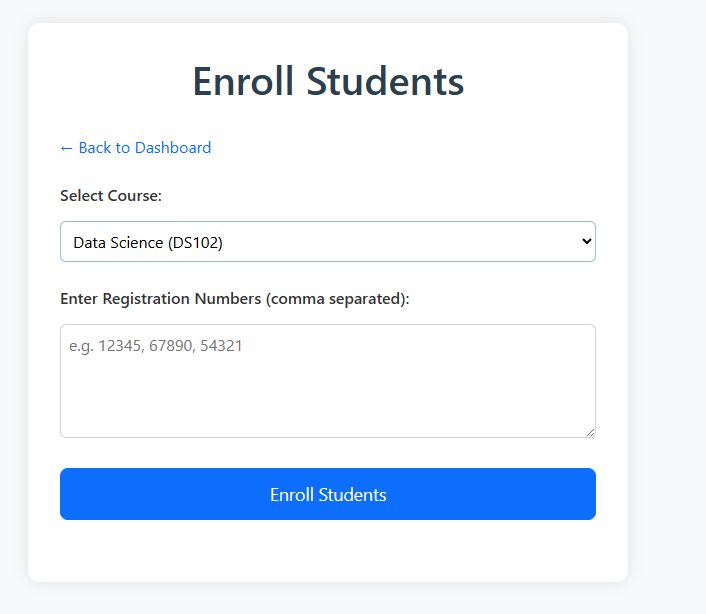

# 🎓 Student Course Tracker

A full-stack web application for managing courses, assignments, and enrollments between students and teachers. Designed to streamline academic tracking, assignment submissions, and student-teacher interactions.

---

## 📘 Project Overview

The Student Course Tracker is an academic management system that allows teachers to:
- Create and manage courses and assignments
- View enrolled students and their submissions

And allows students to:
- View enrolled courses
- Submit assignments
- Track their assignment statuses

---

## 🚀 Features

### 🧑‍🏫 Teachers
- Register/Login securely
- Add and manage courses
- Add and manage assignments
- View and grade student submissions
- View enrolled students per course

### 🎓 Students
- Register/Login securely
- Enroll in courses
- View enrolled courses and assignments
- Submit assignments
- Track assignment submission status and feedback

---

## 🛠️ Technologies Used

- **Frontend**: React, React Router, Bootstrap
- **Backend**: FastAPI or Flask (depending on build)
- **Database**: PostgreSQL / SQLite (for development)
- **ORM**: SQLAlchemy / Tortoise ORM
- **Authentication**: JWT-based Auth
- **Styling**: Bootstrap, Custom CSS
- **File Handling**: UploadFile, Form handling (FastAPI)
- **Testing**: Pytest, Minitests
- **Others**: Chart.js for analytics

---

## 💻 How to Run

### Backend

1. Clone the repository:
   ```bash
   git clone https://github.com/your-username/student-course-tracker.git
   cd student-course-tracker/server
   ```
2. Create virtual environment and install dependencies:
```bash
python -m venv venv
source venv/bin/activate  # On Windows: venv\Scripts\activate
pip install -r requirements.txt
```
3. Run migrations:
```bash
alembic upgrade head
```
4. Start the server:
```bash 
uvicorn main:app --reload
```
## 📸 Application Screenshots

### 🔐 Login Page


### 👨‍🏫 Teacher Dashboard


### 🎓 Student Dashboard


### ➕ Add Course


### ➕ Add Student


### 📄 Create Assignment


### 🧑‍🏫 View Students


### 📝 Assignments List


### ✅ Enroll Students



